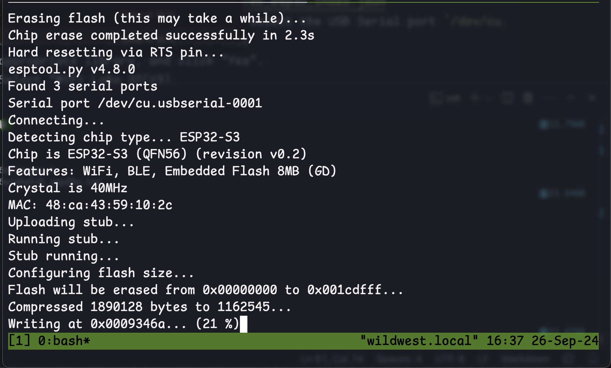

# Setting up the Arduino Development Environment

**CRITICAL: BEFORE YOU PLUG IN THE DEVICE, CONNECT THE ANTENNA.** Failure to connect the antenna may burn out the radio. 

## Hardware and software
[LoRa Board that we used](https://www.amazon.com/dp/B076MSLFC9/ref=sspa_dk_detail_0?psc=1&pd_rd_i=B076MSLFC9&pd_rd_w=5rwFT&content-id=amzn1.sym.953c7d66-4120-4d22-a777-f19dbfa69309&pf_rd_p=953c7d66-4120-4d22-a777-f19dbfa69309&pf_rd_r=32W9SXEYE5R034EX0BZ8&pd_rd_wg=GpSNP&pd_rd_r=c83327df-7025-4040-92db-4c535a094845&s=pc&sp_csd=d2lkZ2V0TmFtZT1zcF9kZXRhaWwy)

[Download the Arduino IDE](https://www.arduino.cc/en/software)

[Download the Meshtastic Library](https://www.arduino.cc/reference/en/libraries/meshtastic/)

# Meshtastic Setup

## Driver installation

[Follow the Meshtastic Instructions](https://meshtastic.org/docs/getting-started/serial-drivers/esp32/)

USB Driver for the linked board: [CP210X USB to UART bridge - Download](https://www.silabs.com/developers/usb-to-uart-bridge-vcp-drivers)

Go to downloads, and download the drivers for your OS. 

**For MacOS**

1. unzip the file that downloaded and run the install `.app` file that downloaded.
2. Follow the wizard to install the driver
3. The extension may be automatically blocked by MacOS. To unblock, go to System Settings -> Privacy & Security
4. There should be a notice that says "Some system software requires your attention before it can be used". Click "Details..."
5. Enable "CP210xVCPDriver.app"
6. The install process should show as successful

**But wait, there's more!**

7. We need to check that the serial driver installation worked. `Apple Menu  > hold down the option key > System Information > Hardware > USB`, and `CP2102 USB to UART Bridge Controller` should be somewhere in the list

## Flashing the firmware

[Follow the instructions](https://meshtastic.org/docs/getting-started/flashing-firmware/esp32/) for flashing the device with Meshtastic firmware.

### Using the Web App

1. Visit [https://flasher.meshtastic.org](https://flasher.meshtastic.org/) in Chrome or Edge. [Link to GitHub for flasher](https://github.com/meshtastic/web-flasher).
2. Make sure the device is plugged in to your computer
3. Select the following configurations:
    - Device: Heltec V3
    - Firmware: the latest **stable** version (`2.4.2.5b45303 Beta`) at the time of writing this
    - **NOTE:** We may need to ensure that we continue to use the *same* version, but for now let's stick with always using the latest, especially during the development phase. 

**NOTE:** The steps after this point, I'm not sure if the configuration I selected was optimal/correct, but it is what worked. 

4. Click "Flash". The browser will ask you to connect to a serial port, and I selected "CP2102 USB to UART Bridge Controller (cu.usbserial-0001)".
5. Click the button by step 1 that says "1200bps Reset"
6. Baud rate: 115200
7. Turn on "Full Erase and Intall"
8. Click the big green button "Erase Flash and Install". Wait a couple of minutes for the LoRa device to turn off, and update. When I did it, it turned back on after a while. **Some instructions indicate that you need to press the physical `RST` button on the device**. 

### Using the Python CLI (Successful)

1. Install the `esptool` package with `pip install --upgrade esptool`
2. Confirm communication with the board by running `esptool chip_id` (if the `esptool` command is not found, you may need to run `python -m esptool` instead)
3. Go to [https://meshtastic.org/downloads/] and download the firmware `.zip`
4. Go to [https://meshtastic.org/docs/hardware/devices/] and identify the page for your device ([HELTEC® LoRa 32](https://meshtastic.org/docs/hardware/devices/heltec-automation/lora32/?heltec=v23))
5. Under **Resources**, the name of the file which contains the firmware should be listed. In our case it is `firmware-heltec-v3-X.X.X.xxxxxxx.bin`. As of September 26, 2024 there are two files in the directory that match this format: `firmware-heltec-v3-2.4.2.5b45303-update.bin` and `firmware-heltec-v3-2.4.2.5b45303.bin`
6. In the terminal, navigate into the `firmware/` directory, and execute `./device-install.sh -f firmware-BOARD-VERSION.bin`. If an update file exists for your version of firmware, subsequently execute `./device-update.sh -f firmware-BOARD-VERSION-update.bin`. See the image for an example.
7. At this point the device should show the Meshtastic logo and the LED will be flashing. 

### Configuration

#### Web Client
1. Go to [https://client.meshtastic.org/], and add a new device via the serial port (only works in Chrome or Edge). 
2. The device we just flashed should appear, and the dashboard should populate with info and configuration settings about your device. If the device name appears as "Unknown" or "UNK", the flashing process **likely** didn't execute correctly. 
3. Connecting the iPhone App will be easier with a fixed Bluetooth PIN. I chose `52024` for this capstone project. Configure this in the Bluetooth setting and move on to the iPhone App configuration.
4. Any changes made to the configuration in this client won't be sent to the device until you save them by clicking the save icon in the top right corner. 

#### iPhone App

1. Download the Meshtastic App on iPhone (You can do Android, but the instructions may be different). 
2. If the device is powered on, it should appear in the app. Select it and enter the PIN we created earlier. 

- Bluetooth PIN: `52024` (graduation month/year)

# Setup without Meshtastic

## Connecting and Configuring the Device

1. Open the Arduino IDE. Go to Settings, and add the following link to add the board configurations and libraries to the Arduino Library index: `https://resource.heltec.cn/download/package_heltec_esp32_index.json`
2. With the board plugged in (**make sure the antenna is plugged in first!**), select the USB Serial port `/dev/cu.SLAB_USBtoUART`, and type in "ESP32" and select `ESP32 Dev Board` from the list
3. Arduino should prompt you to install the appropriate library, and click "Yes". 
4. Originally, we selected the wrong board. Select "WiFi LoRa 32(V3).
5. Select the template `File > Examples > Heltec ESP32 Dev-Boards > Factory_Test > WiFi_LoRa_32_V3 > WiFi_LoRa_32_V3_FactoryTest_V1`

## License Activation

The license for the ESP32 chip may need to be activated following [these instructions](https://docs.heltec.org/general/how_to_use_license.html).

1. Get the chip id
2. Visit the website linked in the above documentation to compute the 32 bit license ID.
3. Flash code to the device containing that license ID in an array
4. Send the command `AT+CDKEY=XXXXX....XXXX` to the device
5. The code should start running now. 

## Writing Software for the device

[Lora API](https://github.com/HelTecAutomation/Heltec_ESP32/blob/master/src/lora/API.md)

[OLED API -- 404 Error]()

To push code to the device, we'll use the example in `examples/OLED_Simple`. 
1. Open the code in the latest version of the Arduino IDE. You'll need to install the appropriate Heltec ESPS32 Libraries within Arduino. 
2. Compile and upload the code to the device using "Upload Using Programmer" (`Shift+Cmd+U` on Mac).

### Node to Node communication

[Read article](https://docs.heltec.org/general/lora_node_to_node.html)

### Meshtastic Arduino Library Dependencies

- [nanopb](https://jpa.kapsi.fi/nanopb/download/)
 - [Instructions on installing nanopb](https://www.dfrobot.com/blog-1161.html)