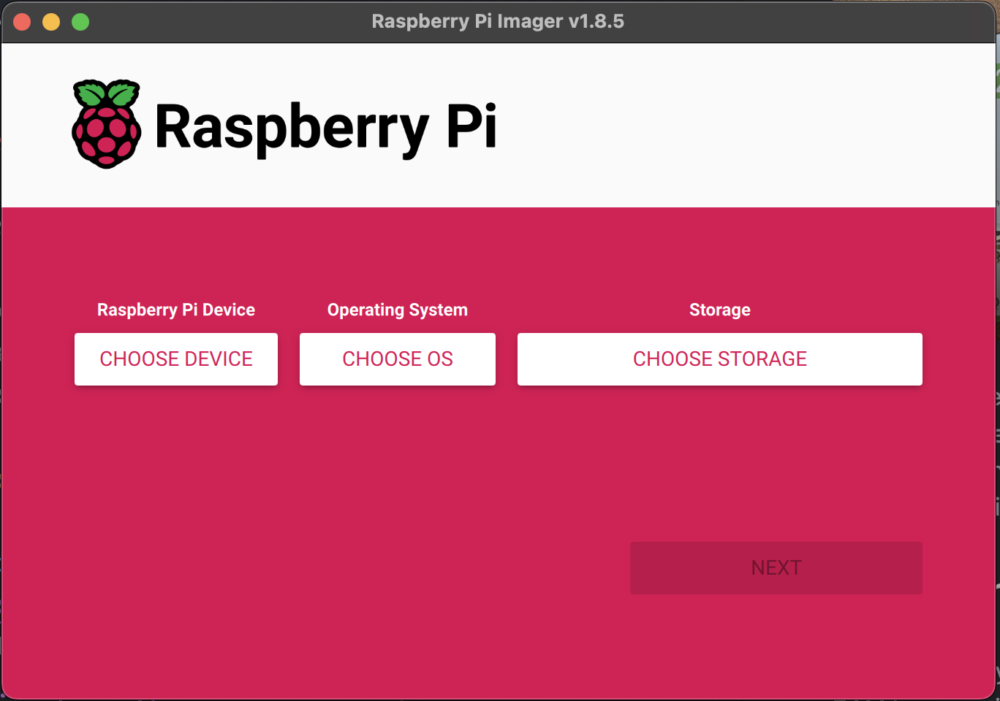
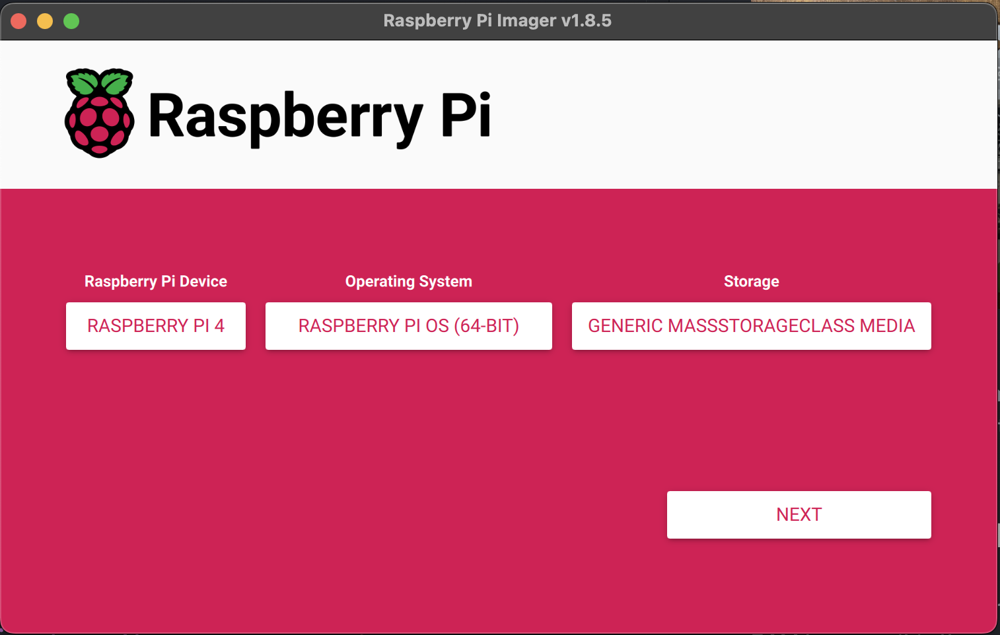
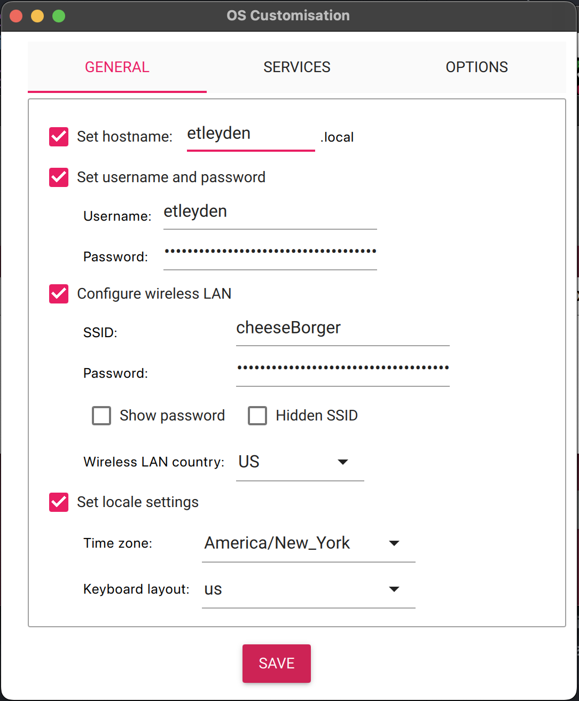
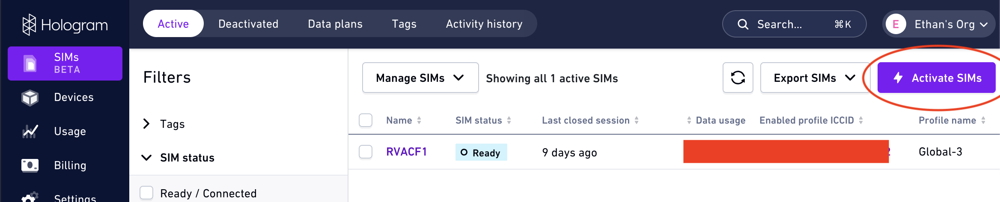
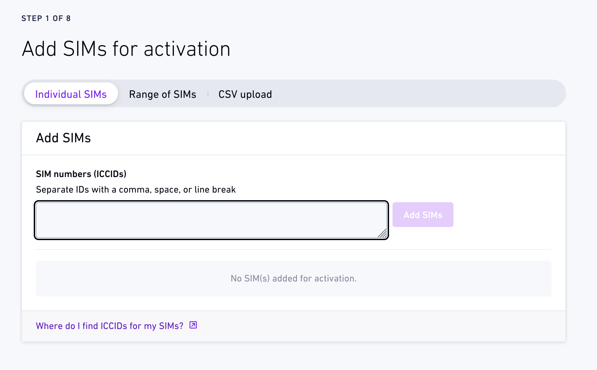

# How to make a Community Refrigerator Monitoring System

This guide will help you build a refrigerator monitoring device that allows you to monitor temperature and door usage using the following components, with the approximate total cost of $100:  

- [Raspberry Pi 4B (~$35)](https://www.pishop.us/product/raspberry-pi-4-model-b-1gb/)
- [Hologram SIM ($3 + $6 shipping)](https://store.hologram.io/)
- [USB 4G LTE Router/Modem ($15-$20)](https://a.co/d/ffFiXdH)
- [DS18B20 Temperature Sensor Kit ($6)](https://a.co/d/bkAzglW)
- [Magnetic Door Sensor ($4)](https://www.adafruit.com/product/375)
- [USB-C Power Adapter ($10)](https://a.co/d/eD9EEOX)
- [Micro-SD Card ($10/card with given listing, variable with card size and pack quantity)](https://a.co/d/3Me4vDJk)


This module was designed by a VCU Senior Capstone team intended to be used by RVACF, but also by any community fridge organization. Pictured above are all of the required components, except for the door sensor (it hadn't arrived in the mail yet). You will also need a keyboard, mouse, and **micro-HDMI** cable for set up. Please note that with the appropriate amount of technical aptitude, it would be easy to substitute parts or configure components differently, if needed. 

## Configuring the Raspberry Pi

There are many Raspberry Pi models available. We chose the 4B with 1GB RAM because it is the most cost effective option that also uses USB-C for power. Earlier models will work, but additional or alternative configuration may be necessary. 

**1. Flash Raspberry Pi OS to the operating system**

[Plug your Micro-SD card into any computer](https://www.youtube.com/watch?v=9AIh2Qwz4Rw), and download and install the [Official Raspberry Pi Imager](https://www.raspberrypi.com/software/). 

a. Open the imager


b. Select the following (assuming you have the same parts listed at the beginning): 

    Raspberry Pi Device: Raspberry Pi 4
    Operating System: Raspberry Pi OS (64-bit)
    Storage: Select your Micro-SD card from the list of options



c. Click Next. Then it will ask "Would you like to apply OS Customisation settings?" Click "EDIT SETTINGS". The following screen will appear:



Right now the fields are populated with information I used last time I ran this software. You will want to fill in your own information, depending on your needs. Here is what each of the options mean:

- Set hostname: This will be the name of your device. Optional, but recommended. I recommend naming it after the refrigerator it will be located in, such as "cary-st-fridge" or "studio-23-fridge".
- Set username and password: When you plug in a Raspberry Pi and use it like a normal desktop computer, it will automatically log you in without asking for a username and password. This username and password will be used to access the Pi remotely from another computer [via SSH](https://www.techtarget.com/searchsecurity/definition/Secure-Shell), or for [`sudo` authentication](https://www.geeksforgeeks.org/sudo-command-in-linux-with-examples/). Be sure to make it something memorable, or write it down somewhere you won't lose it. If you lose it, you'll be unable to access the Pi remotely once it's in the fridge, and may need to remove it to use a desktop computer, or re-image the OS. Ideally, it will be the same login for all refrigerators, so authorized project maintainers can access the same fridge using an organization's secret login. 
- Configure Wireless LAN: This is the WiFi authentication credentials that the Pi will use on startup. Once the Pi is out in the wild, we won't need this, but we will need it for set up. Go ahead and put your WiFi credentials in here, and if you want you can delete them later. 
- Set locale settings: This is just your time zone. 

d. Click "SAVE", and it will bring you back to "Would you like to apply OS customisation settings?" Click "YES". You will be asked "All existing data on [device name] will be erased. Are you sure you want to continue?" Click "YES". The imaging process will begin, and it will take about 5 minutes. Once it is complete, you can remove the Micro-SD card from your computer, and insert it into the Pi. Reference the pictures below to see where on the Pi the card should go.


**2. Starting your Raspberry Pi**

a. Now it is time to start up the Pi. Go ahead and plug in the display (micro-HDMI, yes this is actually different from *mini-HDMI*), keyboard, mouse, and power supply. The first start-up may take a few minutes. Fun fact: If you didn't know this already, Raspberry Pi OS is just one of many Linux distros. If you don't know what that means, that's okay for now. 


b. Next we'll make sure our system is up to date. Let's install the latest software by opening up the terminal (click the icon in the top menu bar that looks like a black square with `>_` inside it), and casting the age old spell (type this in and hit "Enter")

```
sudo apt-get update && sudo apt-get upgrade
```

Some lines will print out, as packages are being retrieved, and then you will be asked "Do you want to continue? [Y/n]", just hit "y" and then "Enter". The system will download, unpack, and install updates for a few minutes. Go make a cup of coffee while you wait (or tea, if that's your thing).

c. Next, we'll grab all the code we need from Github. The web browser is really slow, so we'll use the [Git CLI](https://git-scm.com/book/en/v2/Getting-Started-The-Command-Line) which is already installed. Run this command: 

```
git clone https://github.com/VCU-CS-Capstone/CS-25-301-rva-community-fridges
```

FYI you can check that it worked by running `ls`. There will be a bunch of results, but one of them should be `CS-25-301-rva-community-fridges`. We'll use this later. 

[Maybe need to add more here]

## Setting up Hologram

In this part of the tutorial, we will add a new Hologram SIM to our pre-existing account, and connect the 4G LTE Modem to our Rasperry Pi, allowing for wireless connectivity independent of private WiFi networks. 

**1. Log in to the Hologram dashboard:** Using pre-existing credentials, go to https://www.hologram.io, and log in. 

**2. Activate SIMs:** Click on the purple button in the top right that says "Activate SIMs"



a. Enter the ICCID for your SIM card. It is located on the card itself. If it says the number is invalid, double-check that you typed it in correctly (it usually takes me a few tries).




b. Select a coverage area. "United States" should be fine, since we're not sending this module overseas. 

c. Select a payment plan. If you selected "United States" in the last step, "U.S. Pay as you Go (Multi-network)" is the only option, and matches the prices advertised by Hologram.

d. Select a usage limit. This should pause your device once the limit is reached to prevent overage charges. Set this to a comfortable margin of what you think you'll use, or whatever is in your budget. I set it to 50 MB. 

e. Set the custom name to something you'll be able to use to identify which refrigerator this SIM will be located at, preferably matching the name of the Pi it will be attached to. 

f. I skipped adding tags, but this may be a feature you want to use later. 

g. Decide whether or not you want to set up auto-refill. This will replenish your account credits automatically so you don't experience service interuptions when you run out of money on your account. 

h. Review your choices and confirm/finish the activation. 

**3. Put the SIM into the USB 4G LTE Modem**

Now that your SIM is activated, it's time to use the modem. 

a. Take your modem out of the package and flip it over. There should be printed text providing the WiFi SSID, Router IP address, and default login information. We'll need this later, but go ahead and slide that cover off to reveal the SIM slot. 


b. SIM cards come in different sizes, depending on the device it's going in. Fortunately the Hologram SIM card can be punched out of the package to be the size we need. The USB 4G LTE Modem we use in this tutorial takes Micro-SIM cards. You can use the below images for reference. Very carefully punch out the Micro-SIM, and insert it into the modem. In the second image, note the size and orientation of the SIM card in the modem. 


c. Put the cover back on, and remove the USB cover (on the tip of the stick). Plug the modem into your Raspberry Pi. It'll be a tight fit with a keyboard and mouse also plugged in, but we can make it work.


**4. Set up the modem and connect the Pi to the network.**

The 4G LTE modem works by creating a local WiFi network that you can connect devices to, and the modem will act as a, well, modem (and router) to connect you to the internet via cellular.

a. Before anything else, clear your WiFi settings. We want to make sure the Pi is using the modem, and not the current WiFi network. You can go to the network drop-down in the top right (usually the WiFi logo or sometimes an up arrow next to a down arrow), go to "Advanced Options -> Edit Connections...", and remove all saved networks by selecting each of the options in the list, and clicking the "-" button in the bottom left. 

b. Connect to the WiFi network by selecting it from the list of networks in your network settings. The name of the network will be something like "4G-UFI-C47". It will ask for a encryption key (password), and this is printed on the back of the modem. For us it was "1234567890", and it's probably the same for you too. 


c. Connect to the router interface in the web browser. Go to https://[Router-IP] (this is also printed on the back of the modem). For us it is http://192.168.100.1. Log into the interface with the default username and password: "admin". This will bring you to the main page.


d. In the sidebar, navigate to "Advanced -> APN Setting", and select "Profile 1". Fill in the following information:

```
Name: RVACF
APN: hologram
User: RVACF
Password: [Recommended to be the same as other modules]
```

d. Click "Save Configuration" then "Execute". Then, go to "Device Operation" in the sidebar, and click the button that says "Restart" (NOT the one that says "Factory Reset")

[This hasn't worked yet]

## Connecting Temperature and Door Sensor

Next we will set up a DS18B20 temperature sensor and small magnetic door sensor.

**1. Assemble and connect temperature sensor**


The DS18B30 temperature sensor comes in many forms, but the one we linked in this tutorial is the easiest to set up and configure. It comes with a PCB containing the necessary resistor and GPIO pin connectors for our Raspberry Pi. 


a. Use a 3/32" flathead screwdriver to loosen (but not remove!) the screws


b. Insert each of the wires from the temperature sensor into each of the "ports", as shown. "GND" or "Ground" is black, "VCC" or "Voltage" is red, and "DAT" or "Data" is yellow. Once the cable is securely in the clamp, tighten the screws to secure the connection. NOTE: The wires are stranded, so you may want to twist the exposed section of it. This will help make the tip of the wire easier to insert into the clamp. The quality of these connections are important, as this is how data and power will flow through the sensor from the Raspberry Pi. 


c. Next, we'll connect the pins on the PlugableTerminal to the appropriate pins on the Raspberry Pi using the supplied female-to-female DuPont connectors. The colors that came with our kit are yellow, orange, and green. We'll use yellow for data again, orange for ground, and green for voltage. Color doesn't ultimately matter, but making sure each cable is connected to the correct pin is important, so use the colors to your advantage.


d. Reference https://pinout.xyz to understand which are going to be used for ground, voltage, and data. With the GPIO pins of the Pi oriented closest to you, the cable for voltage (green) should be connected to the top left pin. The cable for ground (orange) should be connected to the pin on the bottom row, third from the left. The cable for data (yellow), should be connected to the pin on the top row, fourth from the left. (GPIO 4, the default for 1-wire communication). 


**2. Enable 1-wire communication in the Raspberry Pi software**

a. Follow [this tutorial](https://www.raspberrypi-spy.co.uk/2018/02/enable-1-wire-interface-raspberry-pi/) on how to enable the 1-wire interface on the Raspberry Pi. 

b. We want to check that the temperature sensor is working. After rebooting the Pi at the end of the tutorial, open the terminal and navigate to the `src/fridge_module/` in the code we downloaded earlier. You should be able to get there in one command using:

```
cd ~/CS-25-301-rva-community-fridges/src/fridge_module
```

c. We have a script that will just display the current temperature from the sensor. The live temperature should display, and it should go up when you hold it in your hand (make it warm), and go down when you make it cold (a cup of ice water?). You can execute it using:

```
python read_temp.py
```


**2. Assemble and connect the door sensor.**


## Installing the module in a container

There are usually many solutions for any given problem. This is our solution for concealing and packaging up our refrigerator module into one container, and you might have a better one. Note that at the time of writing this tutorial, the door sensor was not set up, so it's missing from this part of the tutorial, but adding it in should be easy. 

